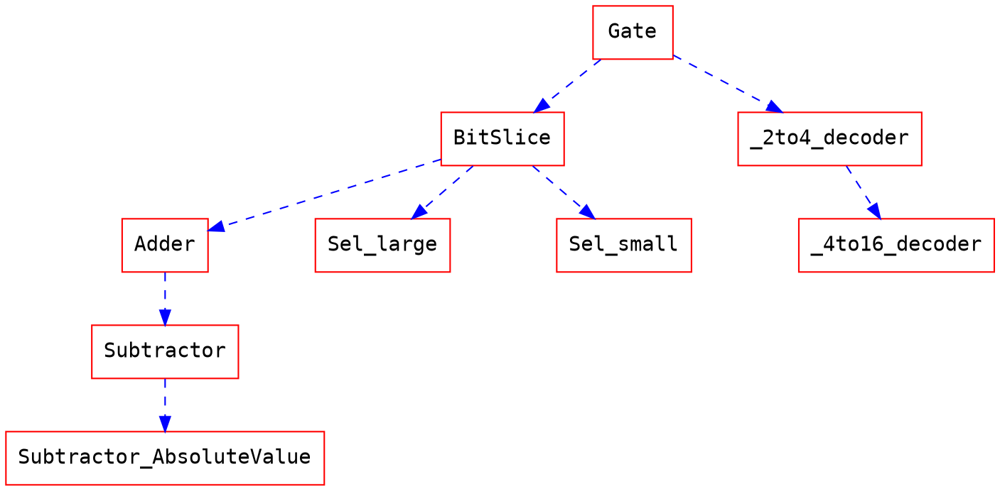

# Lab2 Applications of Multiplexer
[TOC]

## 前言
這次的 lab 我們要來實作一些上課學到(或還沒教到) functions 。這次的 input port 有3個，分別是`A`、`B`、`Sel`，而 output port 有2個，分別是`Out`、`Ovf`。架構圖如下：

|  |
| -------- |


## lab內容描述
主要的架構是使用多工器(MUX)去選取不同的資料，分為十六種，並依`Sel`信號的不同，選取相對應的功能：
- 標題說明:
  - 有要求輸出`Ovf`的 function，`Ovf`==1的時候，`Out`值可以不用管。
  - 在沒有要偵測`Ovf`的 function 請輸出 0。
  - output range 以外的 bit 請設為 0 (除了`A*B`、`A+B`、`A-B`、`|A-B|`作 sign extension )。舉例而言，`A&B` 的結果`Out[3:0]`只有 4 bits 所以要在 `Out[15:4]` 全部設為 0。
  - Bit Slice 請使用 **gate level** 組成。

| Sel value | Function |Description|Restriction|Output range|ovf|
| --------- | --------| --------|--------|-|-|
|   0000    |  priority encoder | input with higher priority will take place | | Out[2:0] |
|   0001    |  A&B |||Out[3:0]|
|   0010    |  A^B |||Out[3:0]|
|   0011    |  A\*B |2’s complement ||Out[7:0]|
|   0100    |  A>>>1'b1 |Arithmetic shift A right by 1-bit ||Out[3:0]|
|   0101    |  A<<<1'b1 |Arithmetic shift A left by 1-bit ||Out[3:0]|
|   0110    |  A>>1'b1 |Logic shift A right by 1-bit ||Out[3:0]|
|   0111    |  A<<1'b1 |Logic shift A left by 1-bit ||Out[3:0]|
|   1000    |  2-to-4   decoder ||<font color="red">Only gate level</font>|Out[3:0]
|   1001    |  4-to-16  decoder  ||<font color="red">Reuse 2-4 decoder</font>|Out[15:0]
|   1010    |  select the larger number|unsigned number|<font color="red">Design bit slice</font>|Out[3:0]
|   1011    |  select the smaller number|unsigned number|<font color="red">Design bit slice</font>|Out[3:0]
|   1100    |  A+B | 2’s complement|<font color="red">Design bit slice</font>|Out[3:0]|o|
|   1101    |  A-B |2’s complement |<font color="red">Reuse adder</font>|Out[3:0]|o|
|   1110    |  \|A-B\||取絕對值|<font color="red">Reuse Subtractor</font>|Out[3:0]|o|
|<font color="red">1111</font>|A\*B|Bonus|<font color="red">Only gate level</font>|Out[7:0]||

---

## __*Process tree*__ for sel 1000~1110


:collision:<font color="red">注意</font>:collision:

- `A`、`B`是兩個 4-bit 的輸入值
- `Sel`代表選取的信號
- `Out`是運算的結果
- `Ovf`是判斷是否 overflow
 
以下將更詳細的定義各`Sel`所對應的輸出情況。

---

<font color="red">`0000` priority encoder</font>：Priority encoder 越左邊的 Bit priority 越高。輸出如下表：
| A    | B    | Out |
| ---- | ---- | --- |
| 0000 | 0001 | 000 |
| 0000 | 001x | 001 |
| 0000 | 01xx | 010 |
| 0000 | 1xxx | 011 |
| 0001 | xxxx | 100 |
| 001x | xxxx | 101 |
| 01xx | xxxx | 110 |
| 1xxx | xxxx | 111 |
<font color="red">`0001` A and B</font>：請輸出`A`&`B` (bit wise)，舉例而言，`A`=0101, `B`=0100, `Out`=0100。

<font color="red">`0010` A xor B</font>：請輸出`A`^`B` (bit wise)，舉例而言，`A`=1001, `B`=1000, `Out`=0001。

<font color="red">`0011` A * B</font>：`A`、`B`在此為 signed number (2's complement) 實作乘法，舉例而言，`A`=0111, `B`=0011, `Out`=00010101。注意在`Out`輸出時要做<font color="red"> sign extension</font>。

<font color="red">`0100~0111` shift</font>：實作`A`的 shift。Reference: https://open4tech.com/logical-vs-arithmetic-shift/

<font color="red">`1000` 2-to-4 decoder</font>：請參照上課筆記與講義。輸出如下表：
| A[3] | B[3] | Out  |
| ---- | ---- | ---- |
| 0    | 0    | 0001 |
| 0    | 1    | 0010 |
| 1    | 0    | 0100 |
| 1    | 1    | 1000 |

<font color="red">`1001` 4-to-16 decoder</font>：請參照上課筆記與講義。輸出如下表：

| A[3:2] | B[3:2] | Out                 |
| ------ | ------ | ------------------- |
| 00     | 00     | 0000_0000_0000_0001 |
| 00     | 01     | 0000_0000_0000_0010 |
| 00     | 10     | 0000_0000_0000_0100 |
| 00     | 11     | 0000_0000_0000_1000 |
| 01     | 00     | 0000_0000_0001_0000 |
| 01     | 01     | 0000_0000_0010_0000 |
| 01     | 10     | 0000_0000_0100_0000 |
| 01     | 11     | 0000_0000_1000_0000 |
| 10     | 00     | 0000_0001_0000_0000 |
| 10     | 01     | 0000_0010_0000_0000 |
| 10     | 10     | 0000_0100_0000_0000 |
| 10     | 11     | 0000_1000_0000_0000 |
| 11     | 00     | 0001_0000_0000_0000 |
| 11     | 01     | 0010_0000_0000_0000 |
| 11     | 10     | 0100_0000_0000_0000 |
| 11     | 11     | 1000_0000_0000_0000 |

<font color="red">`1010` select the larger number</font>：請讓`Out`輸出`A`、`B`當中比較大的那個值(unsigned number)。舉例來說，`A`=0010,`B`=0001,`Out`=0010。如果一樣大請擇一輸出，舉例來說，`A`=0001,`B`=0001,`Out`=0001。

<font color="red">`1011` select the smaller number</font>：請讓`Out`輸出`A`、`B`當中比較小的那個值(unsigned number)。舉例來說，`A`=0010,`B`=0001,`Out`=0001。如果一樣大請擇一輸出，舉例來說，`A`=0001,`B`=0001,`Out`=0001。

<font color="red">`1100` A+B</font>：`A`、`B`在此為 signed number (2's complement)實作加法。舉例而言，`A`=0011, `B`=0001, `Out`=0100。如果輸出發生 overflow 請將`Ovf`的值設為1，其餘狀況為0。舉例而言，`A`=0111, `B`=0001, `Out`=(don't care), `Ovf`=1。注意在`Out`輸出時要做<font color="red"> sign extension</font>。

<font color="red">`1101` A-B</font>：`A`、`B`在此為 signed number (2's complement)實作減法。舉例而言，`A`=0011, `B`=0001, `Out`=0010。如果輸出發生 overflow 請將`Ovf`的值設為1，其餘狀況為0。舉例而言，`A`=1000, `B`=0001, `Out`=(don't care), `Ovf`=1。注意在`Out`輸出時要做<font color="red"> sign extension</font>。


<font color="red">`1110` |A-B|</font>：`A`、`B`在此為 signed number (2's complement)實作減法取絕對值。舉例而言，`A`=0011, `B`=0001, `Out`=0010。如果輸出發生 overflow 請將`Ovf`的值設為1，其餘狀況為0。舉例而言，`A`=1000, `B`=0001, `Out`=(don't care), `Ovf`=1。注意在`Out`輸出時要做<font color="red"> sign extension</font>。
 <font color="red">Beware</font>：__如果在取絕對值前已經 overflow 那就直接輸出`ovf`=1，__

<font color="red">`1111` A*B</font>：請全程使用 **gate level** 實作`A`乘`B`。此題為 Bonus，可以不用做。注意在`Out`輸出時要做<font color="red"> sign extension</font>。

## Template
請根據以下 template 做修改：
```verilog=
`timescale 1ns/1ps

module AM(A, B, Sel, Out, Ovf);
input [3:0] A;
input [3:0] B;
input [3:0] Sel;
output [15:0] Out;
output Ovf;

//(your code)...

endmodule

```


## 工作站呈現

本次 Lab 有附 makefile 檔案，所以 run simulation 的時候可以參考以下指令：
```
make sim
```
以及 run synthesis 的時候可以參考以下指令：
```
make syn
```
另外，如果要清除多餘檔案的話，可以參考以下指令：
```
make clean
make cleaning
```

makefile 指令：https://hackmd.io/s/Bk__YUWIE

跑出來的結果如下：
*Correct Answer*
||
| --- |
*Wrong Answer*
|  |
| --- |

## 備註

- Bonus 計算方式為(總成績*1.1，或根據情況調高)。
- 請不要分享 code 給**任何人**，我們嚴格執行抄襲偵測。
- Demo 時有隱藏測資，請在繳交前確認都寫好。
- 本次助教提供檔案有：`AM.v`、`AM_tb.v`、`info.dat`、`makefile`、`synopsys_dc.setup`。
- synthesis 請參閱: https://hackmd.io/s/r1Z2XpxuN

## 繳交文件
* AM.v
* AM_syn.v
* AM.sdf
* report_area.txt
* lab2_你的學號_report.pdf (Example: **lab2_105062371_report.pdf** )
請包含**設計出來的各種bit slice電路圖**, **模擬結果**, **遇到的問題與解決方法**, **想問助教的問題**等。

請把所有檔案打包成<font color="red">.zip</font>壓縮檔，上傳到iLMS作業區(Example: **lab2_105062371.zip** )

示意圖：
|  |
|----|


## Deadline
4/3(三) 11:59以前上傳到 iLMS，遲交一律 0 分。

# [HOMEPAGE](https://hackmd.io/s/HJdaLPTQV)